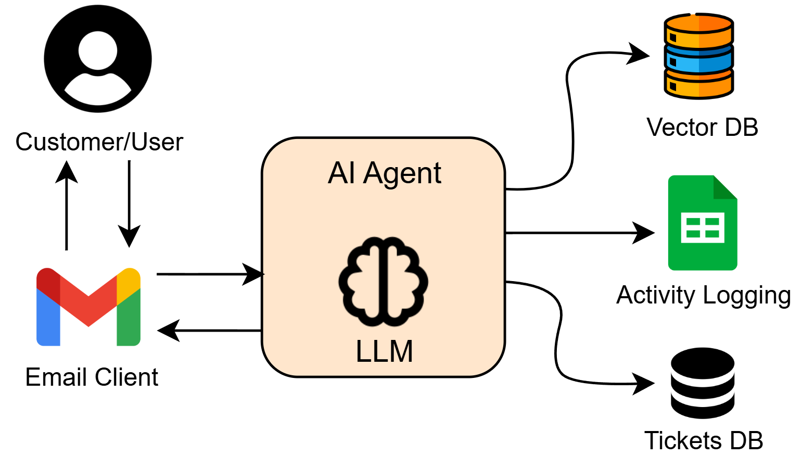

# CRM AI Agent to handle and respond to customer emails

AI agent to handle and respond to customer emails using an internal knowledge base.

## Motivation
Businesses often receive many emails from customers inquiring about products, reporting issues, or requesting assistance. Classifying, responding to, or escalating inquiries efficiently requires significant effort. This project leverages AI to automate email management, providing timely responses and improving customer satisfaction.

## Goal and Objectives
The goal is to develop an AI agent that can:
1. Read and classify emails based on intent or actionable categories.
2. Generate responses using a company knowledge base.
3. Escalate by creating tickets when necessary.
4. Log actions and maintain reports.

## AI Agent Workflow



### Input Data:
- The AI agent checks emails in regular intervals
- Once new emails are received, they are fetched from the email client.

### Reasoning Engine Tasks:
1. Read the email body to classify intent and reason from the input data.
2. Decide actions using an LLM:
    - Determine if knowledge from the vector database (Chromadb) is required to generate a reply email.
    - Identify if a ticket should be created and create tickets in a remote SQL Database.
    - Gather relevant ticket information, including problem description, intent class, reason, and email metadata.
3. Generate a response email using LLM based on the email body, intent, and gathered context (including ticket numbers if created).
4. Log activities in Google Sheets.

### Actions:
- Create tickets via a remote database connection if required.
- Send customer response emails, including the gathered context and ticket number if applicable.
- Log activities into a database for tracking and reporting.

### Tools Involved:
- Email client: fetching emails and replying to them
- Vector Database:  Extracting context from the knowledge base
- Remote SQL Database: Create tickets
- Google Sheets: Log AI Agent activities 

## Project Structure
- `app/`: Contains the application code.
- `requirements.txt`: Lists the dependencies.
- `.env`: Stores environment variables.
- `Dockerfile`: Used to containerize the application.

### Main Technologies Involved
- Python 3.10 and surrounding libs
- FastAPI: Application
- Docker: Deploy containerised application
- LangChain: To create LLM, prompt and function chains
- OpenRouter API (keys) for LLMs: LLM invokation are done with API endopoints (Llama 3.2 30b)
- Google APIs: Build connections to Google Gmail client and app API to Google Sheets 

## How to Run --TODO--

### Run Locally

#### Using Docker
1. Build the Docker image:
   ```bash
   docker build -t crm-ai-agent .
   ```
2. Run the Docker container:
   ```bash
   docker run -p 8000:8000 --env-file .env crm-ai-agent
   ```
3. Access the application at `http://localhost:8000`.

#### Without Docker
1. Install dependencies:
   ```bash
   pip install -r requirements.txt
   ```
2. Run the application:
   ```bash
   uvicorn app.main:app --host 0.0.0.0 --port 8000 --reload
   ```
### Run in Cloud (Deploy)

#### Deploy in AWS EC2 via CI/CD with GitHub workflow
--TODO--

## Future Work
- Enhance the knowledge base with additional sources.
- Integrate with advanced ticketing systems.
- Add a dashboard for analytics and reporting.

---

Feel free to reach out for any clarifications or suggestions. Enjoy using the CRM AI Agent!


